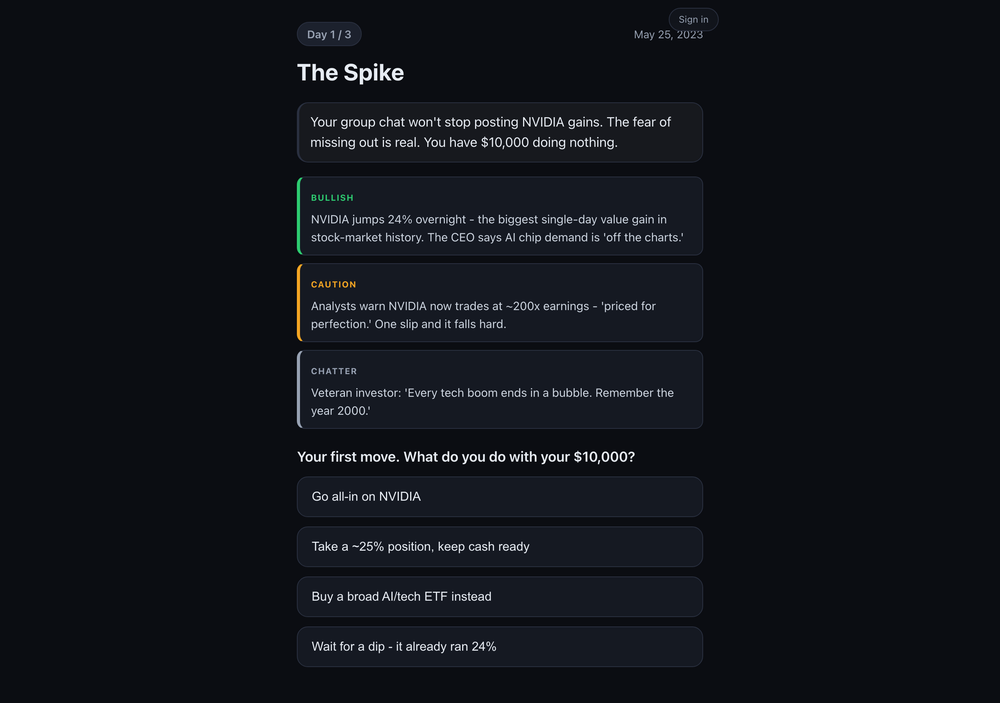
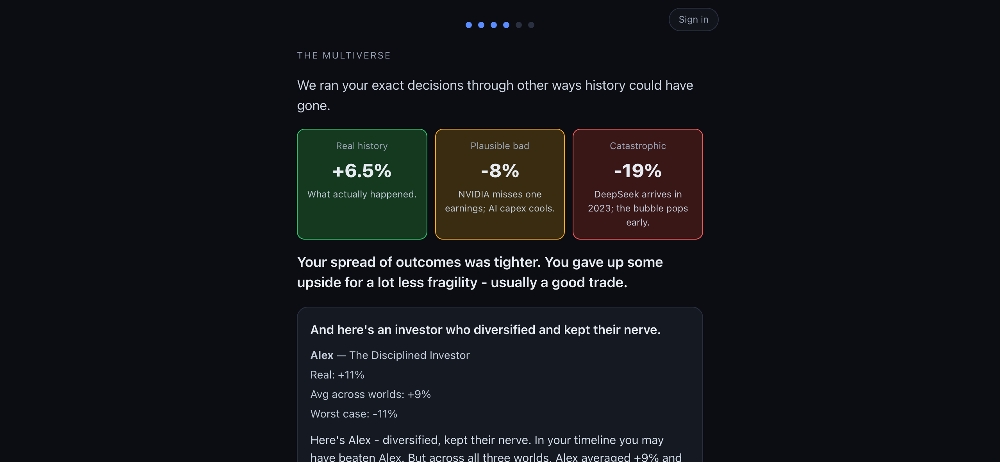
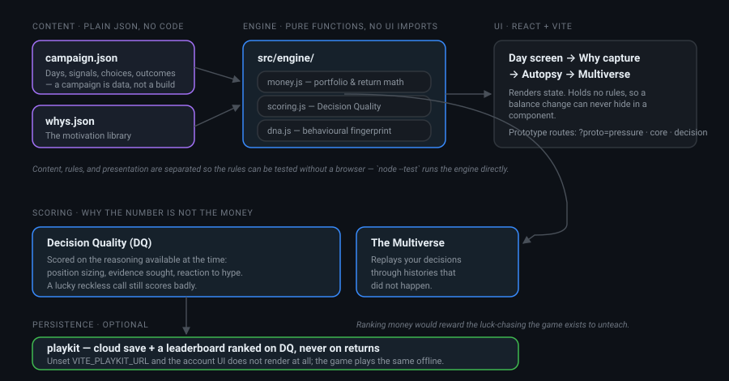

# Investment Time Machine

<p align="center">
  
</p>

<p align="center"><a href="https://investment-time-machine.fly.dev"><b>Play it in your browser</b></a></p>

A pixel-art **decision-training game**, not a stock simulator. Players relive real
historical market events (the first campaign is the AI / NVDA boom) and make
financial decisions under genuine uncertainty. The goal isn't to teach finance
facts or predict prices — it's to help players build **judgment, emotional
control, and self-awareness**, and to feel the question:

> *"What kind of life would I build if I consistently made different financial
> decisions?"*

Investing is simply the arena where those decisions happen. The real subject is
life.

<p align="center">
  
</p>

<p align="center"><em>The end of a run. Your decisions are replayed through histories that didn't happen — because whether this particular timeline was kind to you is the least interesting thing about them.</em></p>

---

## Core philosophy

- **Money is a tool to build the life you want.** Dreams (a first car, moving out,
  supporting family) are the *reason* money matters — not rewards.
- **Show behavior, never the math.** No finance jargon in the gameplay loop. The
  hype lives in characters (Marcus) so a wiser player hears it *as* hype.
- **Process over outcome.** A good decision can lose money; a reckless one can get
  lucky. The game rewards the quality of the decision, never the result.
- **Two Clocks.** Fast emotional feedback at the moment of action is deliberately
  decoupled from the slow financial truth, which is revealed later in an Autopsy.
- **Reveal what was invisible.** The product's job is to surface what the player
  couldn't see while they were inside the decision — the pressure they didn't
  notice, the sources they avoided, luck vs. skill, opportunity cost.
- **Discover information, don't consume it.** The phone *is* the world; the player
  investigates rather than receiving a briefing.

The single bet: does the **Decision Autopsy** make a player say *"I thought I was
right, but now I understand my decision better"*?

---

## Architecture

<p align="center">
  
</p>

Three layers that do not reach into each other:

- **Content** is JSON at the project root. Adding a campaign is authoring data, not
  writing code.
- **The engine** is pure functions with no UI imports, so `node --test` exercises the
  actual rules — the money math, the DQ score, the behavioural fingerprint — without
  a browser anywhere in the loop.
- **The UI** renders state and owns no rules, which means a change to how money moves
  cannot hide inside a component.

Accounts are optional and bolted on at the edge: with `VITE_PLAYKIT_URL` unset the
account UI does not render and the game never makes a network call.

---

## Tech stack

| Layer   | Tools |
|---------|-------|
| UI      | React, Vite |
| Engine  | Pure-function modules (money, scoring, behavioral DNA) — no UI imports |
| Content | `campaign.json` + `whys.json` — data-driven scenarios |
| Testing | `node --test` over the engine |

## Running it locally

```bash
npm install
npm run dev      # http://localhost:5173
npm run build    # production build to dist/
npm test         # engine unit tests (node --test)
```

### Routes

| URL | What it boots |
| --- | --- |
| `http://localhost:5173/` | The main app (intro → day screens → why-capture → autopsy) |
| `http://localhost:5173/?proto=decision` | The standalone **decision-climax** game-feel prototype (the phone, messages, news, the drag-to-commit moment) |
| `http://localhost:5173/?proto=decision&dev=1` | Same prototype with the **behavioral-fingerprint dev panel** visible |

---

## Project structure

```
investment-time-machine/
├── index.html                # Vite entry
├── vite.config.js
├── package.json
├── campaign.json             # full 3-day AI-Boom campaign + autopsy + scenarios (game content)
├── whys.json                 # the Motivation Library (motivations, context menus) — instrument data
├── src/
│   ├── main.jsx              # boot + ?proto=decision toggle
│   ├── App.jsx               # main app shell
│   ├── content.js            # imports campaign.json + whys.json
│   ├── format.js             # number / money / pct formatting helpers
│   ├── styles.css            # all styling (pixel-art look, phone UI, animations)
│   ├── components/
│   │   ├── DecisionClimax.jsx # the decision-climax prototype (phone world + commit)
│   │   ├── DayScreen.jsx      # a day of the campaign
│   │   ├── Intro.jsx
│   │   ├── WhyCapture.jsx     # captures the player's stated motivation
│   │   ├── Signals.jsx
│   │   └── Autopsy.jsx        # the slow-clock reflection
│   └── engine/               # pure functions, runnable under node --test
│       ├── money.js          # portfolio / return math
│       ├── scoring.js        # Decision-Quality (DQ) scoring
│       ├── dna.js            # behavioral "Investor DNA" vector
│       ├── engine.test.js
│       └── coverage.test.js
└── docs/
    └── design-plan-v1.1.md   # full product design plan
```

Game **content** lives in `campaign.json` + `whys.json` at the project root; the
**engine** that interprets it is pure and tested; the **UI** renders it. Content,
engine, and presentation are kept separate on purpose.

---

## Status

Early prototype. The decision-climax loop (`?proto=decision`) is the furthest
along — a fully playable single decision with a diegetic phone, differentiated
information sources, an upside-fantasy dream layer, and silent behavioral capture
for a future Autopsy. The slow-clock Autopsy / time-skip that closes the loop is
the next major piece.
